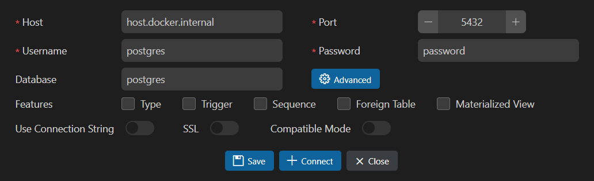

# Pasos para ejecutar el proyecto en Desarrollo

Sigue estos pasos para configurar y ejecutar el proyecto localmente utilizando el devcontainer, Docker Compose y un entorno virtual para depuración:

1. **Abrir el proyecto en modo Devcontainer**  
   - Abre el proyecto en VS Code.  
   - Cuando se detecte el archivo [.devcontainer/devcontainer.json](.devcontainer/devcontainer.json), selecciona "Reopen in Container" para iniciar el entorno de desarrollo.

2. **Configurar el archivo de entorno**  
   - Crea el archivo de variables de entorno copiando el archivo `.env.example`.  
   - En la terminal integrada, ejecuta:
     ```sh
     cp .env.example .env
     ```

3. **Levantar el servicio de PostgreSQL**  
   - Ejecuta el siguiente comando en la terminal integrada para iniciar el contenedor de PostgreSQL definido en [docker-compose.yaml](docker-compose.yaml):
     ```sh
     docker-compose up -d
     ```
   - Con el plugin de postgres pueden configurar la conexion a la base para probar que todo este funcionando

   
---
## 4. Importar la Base de Datos (si la inicialización automática no funciona)

### A. Montaje de Scripts de Inicialización

- La siguiente configuración en `docker-compose.yaml` monta la carpeta `./sql-init` en el contenedor en la ruta `/docker-entrypoint-initdb.d`:

  ```yaml
  volumes:
      - ./sql-init:/docker-entrypoint-initdb.d
  ```

### B. Copiar y Ejecutar Scripts Manualmente

En caso de que los scripts no se copien automáticamente (por ejemplo, si la base ya estaba inicializada), puedes copiar y ejecutar los scripts manualmente sin necesidad de hardcodear el nombre del contenedor:

1. **Obtener el ID del contenedor:**

   ```bash
   CONTAINER_ID=$(docker-compose ps -q postgres)
   ```

2. **Copiar la carpeta `sql-init` al contenedor en una ruta de trabajo (por ejemplo, `/tmp/sql-scripts`):**

   ```bash
   docker cp ./sql-init/ $CONTAINER_ID:/tmp/sql-scripts/
   ```

3. **Ejecutar los scripts SQL dentro del contenedor:**

   ```bash
   docker exec $CONTAINER_ID psql -U postgres -d postgres -f /tmp/sql-scripts/01-sakila-schema.sql
   ```
   
   ```bash
   docker exec $CONTAINER_ID psql -U postgres -d postgres -f /tmp/sql-scripts/02-sakila-data.sql
   ```

---


5. **Configurar el entorno virtual (venv) para depuración**  
   _Nota: Dado que el devcontainer se ejecuta en Linux, solo es necesario utilizar las instrucciones para Linux._  
   - Crea el entorno virtual en la raíz del proyecto:
     ```sh
     python3 -m venv .venv
     ```
   - Actívalo:
     ```sh
     source .venv/bin/activate
     ```
   - Instala las dependencias:
     ```sh
     pip install -r requirements.txt
     ```

6. **Ejecutar y depurar**  
   - Con el entorno configurado y la base de datos en funcionamiento, inicia la depuración presionando F5 o seleccionando la configuración "Python: Ejecutar main" desde la pestaña de depuración en VS Code.

Con estos pasos, tendrás levantado el servicio de PostgreSQL, el entorno Python con las librerías instaladas y la posibilidad de depurar el archivo [main.py](http://_vscodecontentref_/0). ¡Éxitos en el desarrollo!


