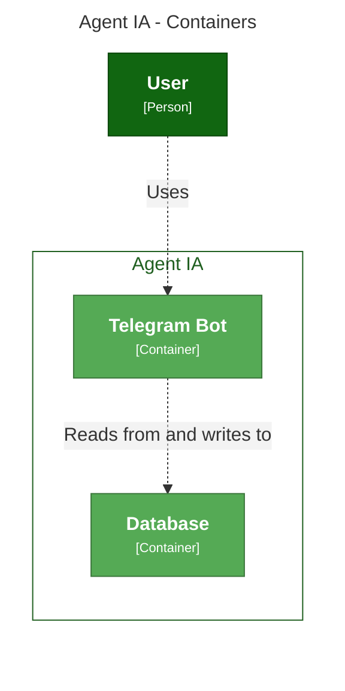
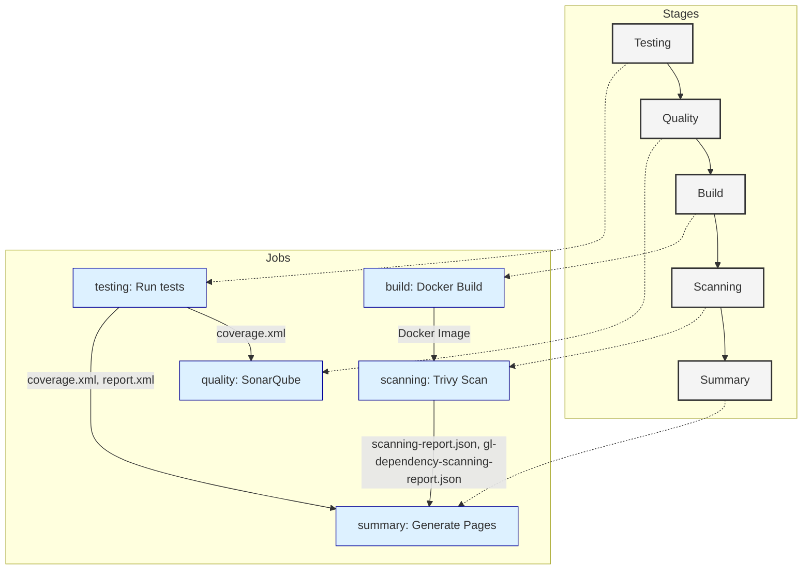

# Telegram Bot con LangChain

[Fuente base de la implementación](https://medium.com/@obaff/building-a-telegram-bot-using-langchain-openai-and-the-telegram-api-1834167e524b)

## Consigna
[Consigna de practico 01](CONSIGNA.md)

## Como ejecutar de forma local
[Ejecutar y Depurar Local con devContainer](DEVLOCAL.md)

---

## Contenido

- [Introducción](#introducción)
- [Requisitos](#requisitos)
- [Arquitectura](#arquitectura)
- [Instalación y Ejecución](#instalación-y-ejecución)
- [Pruebas (Testing)](#pruebas-testing)
- [Docker y Docker Compose](#docker-y-docker-compose)
- [CI/CD](#cicd)
  - [Quality - SonarCloud](#quality---sonarcloud)
  - [Seguridad y SBOM](#seguridad-y-sbom)
- [Resumen del CICD](#resumen-del-cicd)
- [Referencias](#referencias)

---

## Introducción

Este proyecto integra un bot de Telegram con LangChain para proporcionar funcionalidades inteligentes. La aplicación se conecta a servicios como PostgreSQL y emplea diversas herramientas para pruebas, análisis de calidad y seguridad.

---

## Requisitos

- **Python 3.11** o superior.
- Dependencias de Python listadas en [requirements.txt](requirements.txt):
  - `python-telegram-bot`
  - `langchain`
  - *etc.*

Para las pruebas se utilizan:  
- `pytest`
- `pytest-cov`

---

## Arquitectura

La estructura del proyecto es la siguiente:

```
.
├── .env
├── .gitlab-ci.yml
├── README.md
├── Dockerfile
├── docker-compose.yaml
├── requirements.txt
├── config.py
├── main.py
├── bot/
│   └── telegram_bot.py
├── database/
│   └── postgres_db.py
├── llm/
    └── agent.py

```

### Diagrama C4



---

## Instalación y Ejecución

1. **Clonar el repositorio y configurar variables de entorno**  
   Copia el archivo `.env.example` a `.env` y configura las claves necesarias (por ejemplo, `TELEGRAM_BOT_TOKEN` y `GOOGLE_API_KEY`).

2. **Instalar dependencias**

   ```bash
   pip install -r requirements.txt
   ```

3. **Ejecutar la aplicación**

   ```bash
   python3 main.py
   ```

---

## Pruebas (Testing)

Para ejecutar las pruebas unitarias y generar reportes de cobertura, usa:

```bash
pytest --cov=. --cov-report=xml --junitxml=report.xml
```

Los archivos generados serán:
- `coverage.xml` (formato Cobertura)
- `report.xml` (resultados en formato JUnit)

Ejemplo de configuración en GitLab CI:

```yaml
artifacts:
  paths:
    - coverage.xml
    - report.xml
```

Los tests se encuentran en la carpeta `test/`.

---

## Docker y Docker Compose

### Dockerfile

El [Dockerfile](Dockerfile) utiliza la imagen base `alpine:latest` con configuraciones para Python:

```dockerfile
FROM .....

WORKDIR /app

.....

CMD ["python3", "......"]
```

### Docker Compose

Levanta todos los servicios (bot, base de datos, etc.) con:

```bash
docker-compose up --build
```

El archivo [docker-compose.yaml](docker-compose.yaml) define la configuración de los contenedores.

---

## CI/CD

- States y Jobs con sus Artefactos 

---



El pipeline en GitLab CI (definido en [.gitlab-ci.yml](.gitlab-ci.yml)) está compuesto por varias etapas:

### Testing

Ejecuta las pruebas y genera reportes de calidad y cobertura.

### Quality - SonarCloud

[SonarQube + Gitlab](https://wiki.geant.org/display/GSD/Continuous+Integration+Setup+with+GitLab+CI+and+SonarQube)

Utiliza SonarCloud para el análisis de la calidad del código. Ejemplo de comando:

```bash
/usr/bin/entrypoint.sh sonar-scanner \
  -Dsonar.login="$SONAR_LOGIN" \
  -Dsonar.organization="$SONAR_ORGANIZATION" \
  -Dsonar.host.url="$SONAR_URL" \
  -Dsonar.projectKey="$SONAR_PROYECT_KEY" \
  -Dsonar.python.coverage.reportPaths=coverage.xml
```

La salida se captura como artifact (`sonar.log`) para su revisión.

### Seguridad y SBOM

[vulnerabilities](https://medium.com/@maheshwar.ramkrushna/scanning-docker-images-for-vulnerabilities-using-trivy-for-effective-security-analysis-fa3e2844db22)

Se emplea [Trivy](https://github.com/aquasecurity/trivy) para:
- Escanear la imagen en busca de vulnerabilidades:
  
  ```bash
  trivy image $IMAGE --exit-code 0 --severity CRITICAL,HIGH --format template --template "@./contrib/gitlab-codequality.tpl" -o scanning-report.json
  ```
  
- Generar un SBOM en formato SPDX:
  
  ```bash
  trivy image $IMAGE --exit-code 0 --format spdx-json -o gl-dependency-scanning-report.json
  ```

Los artifacts correspondientes se configuran en el CI para que GitLab los integre en el Security Dashboard.

---

## Resumen del CICD

El pipeline finaliza mostrando un resumen en GitLab Pages, donde se agrupan los resultados de pruebas, cobertura y escaneos de seguridad.

Consulta el [Gitlab Pages](https://telegram-bot-ia-talk-database-f72817.gitlab.io/) para ver el resumen en formato HTML.

---

## Referencias

- [Documentación de Python Telegram Bot](https://github.com/python-telegram-bot/python-telegram-bot)
- [LangChain en GitHub](https://github.com/langchain-ai/langchain)
- [PostgreSQL Sakila](https://github.com/openpotato/sakila-db/tree/main/PostgreSQL)
- [Trivy - Seguridad de Contenedores](https://github.com/aquasecurity/trivy)
- [SonarCloud](https://sonarcloud.io)

---

Este README busca ser una guía de referencia para comprender el funcionamiento del proyecto, facilitar su despliegue y asegurar la calidad, seguridad y cobertura de pruebas a lo largo del ciclo de vida del desarrollo.